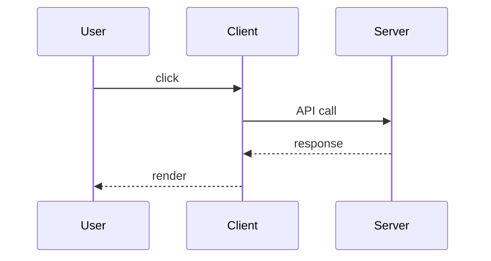

# Prompt: Create Interview Question File

## Context

This repository contains interview preparation materials for a Senior+ Frontend Developer.
Files are organized by topic and skill level inside `interviews/`.

## Folder Scope

Create level files ONLY in these folders (each subfolder gets all 4 files):

```
interviews/
  frontend/         → react, typescript, nextjs, state-management, css, styling, forms, performance, browser, tooling
  data-and-api/     → rest, websockets, tanstack-query, graphql, auth
  architecture/     → patterns, component-design, fsd, micro-frontends, system-design, adr
  testing/          → unit, e2e, a11y, security, code-review
  devops/           → git, docker, ci-cd, cloud
  backend/          → nodejs, sql, oop
```

Do NOT create level files in `behavioral/` or `companies/`.

## Naming Convention

Files must use a numeric prefix and include both topic name and level so they sort correctly and are self-descriptive:

Pattern: `{number}_{topic}_{level}.md`

| File                  | Level  | Assumes knowledge of     |
| --------------------- | ------ | ------------------------ |
| `1_{topic}_junior.md` | Junior | —                        |
| `2_{topic}_middle.md` | Middle | Junior                   |
| `3_{topic}_senior.md` | Senior | Junior + Middle          |
| `4_{topic}_expert.md` | Expert | Junior + Middle + Senior |

Examples:

- `1_react_junior.md`
- `2_typescript_middle.md`
- `3_state-management_senior.md`
- `4_nextjs_expert.md`

Topic name must match the folder name (lowercase, hyphens preserved for multi-word topics: `state-management`, `tanstack-query`, `micro-frontends`).

## File Structure Template

Each file must follow this exact structure:

```markdown
# {Topic Name} — {Level}

## Вопросы

- [Вопрос первый?](#вопрос-первый)
- [Вопрос второй?](#вопрос-второй)
- [Вопрос третий?](#вопрос-третий)

---

## Вопрос первый?

Ответ на первый вопрос.

---

## Вопрос второй?

Ответ на второй вопрос.

---

## Вопрос третий?

Ответ на третий вопрос.
```

## Rules

1. **H1 heading**: `# {Topic Name} — {Level}` — e.g. `# React — Junior`, `# TypeScript — Senior`
2. **`## Вопросы`** section contains a bullet list of anchor links to every question in the file
3. **Anchor format**: GitHub Flavored Markdown style — lowercase, spaces → hyphens, special chars removed
   - `Что такое замыкание?` → `#что-такое-замыкание`
   - `Как работает useEffect?` → `#как-работает-useeffect`
   - **Long questions (anchor > 50 chars)**: shorten to the key concept only
     - Full heading: `## Что такое useMemo и useCallback — в чём разница и когда что использовать?`
     - Shortened anchor: `(#usememo-и-usecallback-разница)`
     - The H2 heading stays full — only the anchor link in the list is shortened
4. Each question is an **H2 heading** — this creates the anchor target automatically
5. Separate each Q&A block with `---`
6. **No question repetition** across levels within the same topic folder — each level adds new depth
7. **Question count guidelines**:
   - Junior: 5–8 questions — fundamentals, definitions, basic usage
   - Middle: 6–10 questions — patterns, trade-offs, real-world scenarios
   - Senior: 6–10 questions — architecture, edge cases, performance, internals
   - Expert: 4–7 questions — deep internals, system design, custom implementations
8. **Language**: All questions and answers must be written in **Russian**
9. Code blocks must use the full language name: ` ```typescript `, ` ```javascript `, ` ```bash `

## Answer Guidelines

- **Junior**: 2–3 предложения + простой пример кода если применимо
- **Middle**: 3–5 предложений + пример с пояснениями, trade-offs
- **Senior**: 4–6 предложений + архитектурная диаграмма (Mermaid) или сложный пример
- **Expert**: 6–8 предложений + ссылки на исходный код / спецификации где уместно
- **Если ответ не применим к уровню**: явно укажи `> Не применимо к этому уровню.` и не оставляй блок пустым

## Mermaid Usage

Для Senior+ вопросов по архитектуре предпочитай Mermaid вместо ASCII-диаграмм.
Оборачивай в блок с языком `mermaid`:

````markdown

````

Типы диаграмм по ситуации:

- `sequenceDiagram` — жизненный цикл запроса, взаимодействие компонентов
- `graph TD` — архитектура системы, дерево зависимостей
- `flowchart LR` — алгоритмы, flow принятия решений

## Edge Cases

1. **Existing files**:
   - Add new questions at the end of the file
   - If an existing question is outdated or incorrect: keep it, but add a `> **Обновление**: ...` callout below the answer
   - Never delete questions automatically
2. **Missing levels**: If a topic genuinely has no Junior-level questions (e.g., `micro-frontends`), start from Middle and add a note in H1: `# Micro-Frontends — Middle (нет Junior уровня)`
3. **Same-topic deduplication**: Before adding a question, verify it doesn't appear in other level files of the same topic folder.
4. **Cross-topic deduplication**: If a question logically belongs to multiple topics (e.g., «Что такое мемоизация?» fits both `react` and `performance`) — add it to the **most relevant** topic only. In other topics add a reference:
   > См. также: [Что такое мемоизация?](../performance/3_performance_senior.md#что-такое-мемоизация)

## Knowledge Dependencies

When creating questions, assume the candidate knows prerequisite topics:

| Topic              | Prerequisites               |
| ------------------ | --------------------------- |
| `typescript`       | JavaScript (any level)      |
| `nextjs`           | React (same level or lower) |
| `graphql`          | REST basics                 |
| `tanstack-query`   | REST basics                 |
| `testing/*`        | The technology being tested |
| `state-management` | React basics                |

If a question requires knowledge outside the assumed prerequisites, add:

> **Prerequisite**: понимание [topic]

## Anchor Validation

Every `[text](#anchor)` must have a matching `## Heading` in the same file.

Slug rules: lowercase → trim → spaces to hyphens → remove all special characters except hyphens.

Examples:

- `Что такое Virtual DOM?` → `#что-такое-virtual-dom`
- `Как работает useEffect?` → `#как-работает-useeffect`

Quick check — find broken anchors with this regex (match = problem):

```
\[.+?\]\(#[^)]*[^\w\-а-яёА-ЯЁ][^)]*\)
```

Valid anchor characters: lowercase letters (including Cyrillic), digits, hyphens only.

## Quality Checklist

Each generated file must pass:

- [ ] Questions match the depth of the declared level (no Junior questions in a Senior file)
- [ ] No question duplicated across files in the same topic folder
- [ ] No question duplicated in a more relevant topic folder (cross-topic check)
- [ ] All anchor links correctly resolve to H2 headings in the same file
- [ ] Long anchors (> 50 chars) are shortened in the link but the H2 heading stays full
- [ ] Each answer has a code example or Mermaid diagram where applicable
- [ ] Questions are realistic interview questions — not trivial or too academic
- [ ] Empty/inapplicable answers use `> Не применимо к этому уровню.` instead of blank

## Anti-Example (DO NOT do this)

```markdown
## Что такое React?

React — это библиотека. (слишком коротко, нет глубины)
```

**Correct:**

```markdown
## Что такое React и какие проблемы он решает?

React — это JavaScript-библиотека для построения пользовательских интерфейсов.
Решает три ключевые проблемы:

1. **Сложность работы с DOM** → виртуальный DOM для батчинга обновлений
2. **Управление состоянием** → однонаправленный поток данных
3. **Переиспользование кода** → компонентная архитектура
```

---

## Example: React — Junior

```markdown
# React — Junior

## Вопросы

- [Что такое React и зачем он нужен?](#что-такое-react-и-зачем-он-нужен)
- [В чём разница между state и props?](#в-чём-разница-между-state-и-props)
- [Что такое JSX?](#что-такое-jsx)

---

## Что такое React и зачем он нужен?

React — это JavaScript-библиотека для построения UI. Использует компонентную архитектуру
и виртуальный DOM для эффективного обновления интерфейса при изменении данных.

---

## В чём разница между state и props?

- **Props** — входные данные, передаются от родителя к дочернему компоненту, только для чтения.
- **State** — внутреннее изменяемое состояние компонента, управляется им самим.

Props текут вниз, state локален и вызывает ре-рендер при изменении.

---

## Что такое JSX?

JSX — расширение синтаксиса JavaScript, похожее на HTML. Компилируется Babel в вызовы `React.createElement()`.

\`\`\`typescript
const element = <h1>Hello</h1>;
// компилируется в:
const element = React.createElement('h1', null, 'Hello');
\`\`\`
```

---

## Example: React — Expert

```markdown
# React — Expert

## Вопросы

- [Как реализовать кастомный React-рендерер?](#как-реализовать-кастомный-react-рендерер)
- [Что такое Fiber и как работает алгоритм согласования?](#что-такое-fiber-и-как-работает-алгоритм-согласования)

---

## Как реализовать кастомный React-рендерер?

Кастомный рендерер реализуется через пакет `react-reconciler`. Необходимо предоставить
host config — объект с методами для работы с целевой платформой.

Ключевые методы host config:

- `createInstance()` — создание узла платформы
- `appendChild()` / `insertBefore()` — добавление в дерево
- `commitUpdate()` — применение изменений после диффинга

\`\`\`typescript
import Reconciler from 'react-reconciler';

const hostConfig = {
createInstance(type, props) { /_ создаём узел _/ },
appendChildToContainer(container, child) { /_ монтируем _/ },
commitUpdate(instance, updatePayload, type, oldProps, newProps) { /_ патчим _/ },
// ... остальные методы
};

const renderer = Reconciler(hostConfig);
\`\`\`

Именно так реализованы `react-native`, `react-three-fiber`, `ink` (React для терминала).

---

## Что такое Fiber и как работает алгоритм согласования?

Fiber — внутренняя архитектура React (с версии 16), заменившая рекурсивный алгоритм
на итеративный с возможностью прерывания.

Каждый компонент — Fiber-узел со связным списком: `child`, `sibling`, `return`.
Поля `lanes` определяют приоритет обновления.

Работа разделена на две фазы:

1. **Render (прерываемая)** — обход дерева, вычисление diff, без side effects
2. **Commit (синхронная)** — применение изменений к DOM

Это позволяет React прерывать рендеринг низкоприоритетных обновлений в пользу срочных
(анимации, ввод пользователя) — основа Concurrent Mode и Transitions.
```
