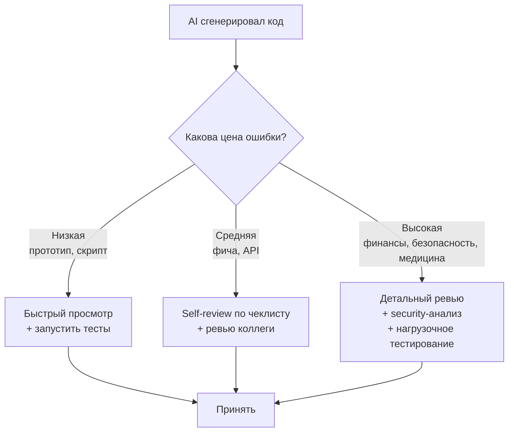
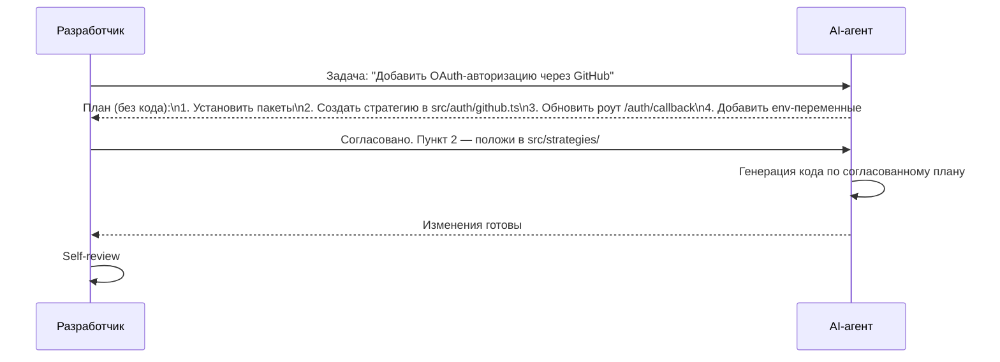
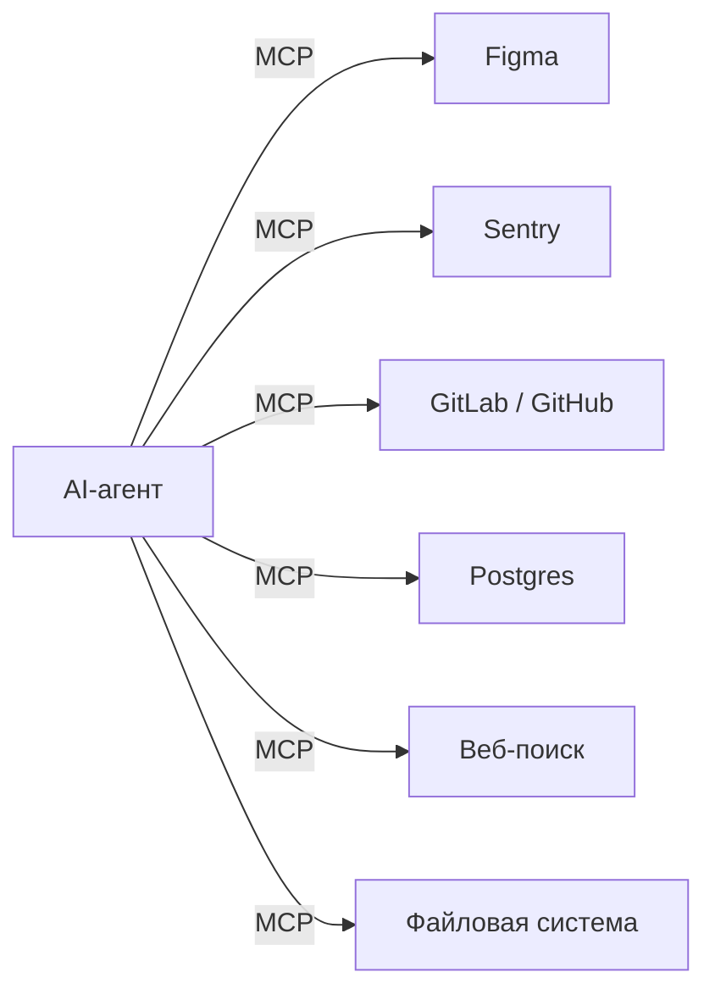
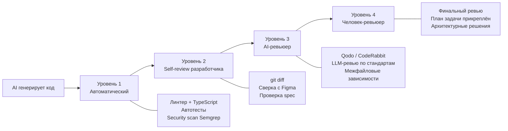
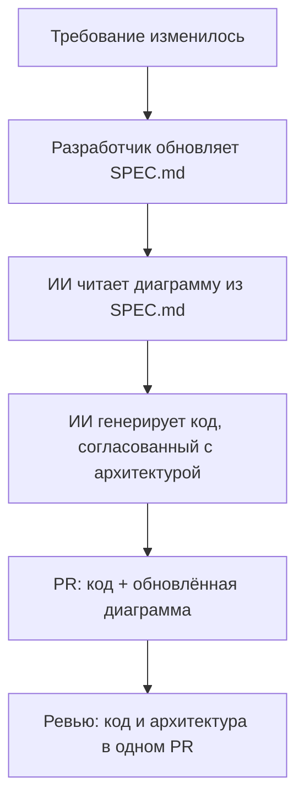

# Разработка с ИИ — Senior

## Вопросы

- [Что такое риск-менеджмент при работе с AI-кодом?](#что-такое-риск-менеджмент-при-работе-с-аи-кодом)
- [Что такое Plan-First подход и как он улучшает результат?](#что-такое-plan-first-подход-и-как-он-улучшает-результат)
- [Что такое MCP-протокол и как он расширяет возможности агентов?](#что-такое-mcp-протокол-и-как-он-расширяет-возможности-агентов)
- [Как обеспечивается безопасность при использовании ИИ в корпоративных проектах?](#безопасность-при-использовании-аи-в-корпоративных-проектах)
- [Какие уровни контроля качества AI-генерированного кода существуют?](#уровни-контроля-качества-аи-генерированного-кода)
- [Что такое «диаграммы как код» и зачем это в AI-разработке?](#диаграммы-как-код-и-аи-разработка)
- [Как обучать разработчиков в эпоху ИИ?](#как-обучать-разработчиков-в-эпоху-аи)

---

## Что такое риск-менеджмент при работе с AI-кодом?

Риск-менеджмент — умение регулировать степень въедливости при проверке кода в зависимости от **цены ошибки** в конкретном месте. Не весь код одинаково важен: ошибка в скрипте для генерации отчёта и ошибка в модуле расчёта транзакций имеют принципиально разные последствия.

Постоянно задавайте вопрос: «Каковы последствия ошибки здесь?» Три вещи в комплексе:
- **Тщательная проверка** там, где надо (критичный код, безопасность)
- **Спокойный пропуск** там, где не надо (бойлерплейт, шаблонный код)
- **Мудрость** отличать первое от второго

**Связанные задачи:**
<!-- Связанных задач нет -->

**Материалы для изучения:**
<!-- Материалы не добавлены -->

---

## Что такое Plan-First подход и как он улучшает результат?

**Plan-First** — практика, при которой перед написанием кода AI-агент сначала формирует и согласует с разработчиком верхнеуровневый план изменений. Только после явного подтверждения плана агент переходит к реализации.

Преимущества Plan-First:
- **Предотвращает архитектурные ошибки** до написания кода (дешевле исправить план, чем рефакторить)
- **Сохраняет контекст**: план = документ, к которому можно вернуться
- **Даёт разработчику контроль**: несогласованные изменения не попадают в кодовую базу
- **Упрощает будущий поиск**: план прикрепляется к тикету, объясняя принятые решения

Практика реализуется через system prompt: «Прежде чем писать код, опиши план изменений и жди моего подтверждения».

**Связанные задачи:**
<!-- Связанных задач нет -->

**Материалы для изучения:**
- [Anthropic: Agentic coding best practices](https://docs.anthropic.com/en/docs/claude-code/best-practices)

---

## Что такое MCP-протокол и как он расширяет возможности агентов?

**MCP (Model Context Protocol)** — открытый стандарт (Anthropic, 2024), который даёт AI-агентам «органы чувств» — стандартизированный способ подключения к внешним сервисам: базам данных, API, инструментам разработки.

**Конкретные сценарии:**
- **Figma MCP**: агент читает параметры макетов напрямую → точная вёрстка без ручного переноса значений
- **Sentry MCP**: агент анализирует ошибки в реальном времени, смотрит stacktrace, связывает с конкретным кодом → автоматизация дебаггинга
- **GitLab MCP**: агент оценивает diff, оставляет комментарии к Merge Request
- **Database MCP**: агент может выполнять запросы для понимания схемы данных

**Важно**: каждый MCP-сервер — потенциальная поверхность для prompt injection атак. Перед подключением проверяйте, что сервер проверен сообществом или написан вашей командой.

**Связанные задачи:**
<!-- Связанных задач нет -->

**Материалы для изучения:**
- [MCP: Official documentation](https://modelcontextprotocol.io/)
- [Anthropic: MCP introduction](https://www.anthropic.com/news/model-context-protocol)

---

## Безопасность при использовании ИИ в корпоративных проектах?

В enterprise-разработке (особенно финтех, медицина, юриспруденция) использование внешних AI-сервисов сопряжено с рисками утечки данных и нарушения NDA.

**Уровни проблем и решений:**

| Риск | Решение |
|------|---------|
| Персональные данные клиентов уходят во внешний LLM | Внутренние AI-агенты через специальные фильтры; внешний ИИ видит только структуру кода, не данные |
| Конфиденциальный код (алгоритмы, бизнес-логика) утекает | Self-hosted LLM (Ollama + Llama/Mistral) или приватный деплой OpenAI Enterprise |
| ИИ нарушает корпоративные стандарты безопасности (OWASP) | Статический анализ кода (Semgrep, CodeQL) как обязательный CI-шаг после AI-генерации |
| Зависимость от стороннего API | Абстракционный слой над LLM, возможность переключения между провайдерами |

**Практика финтеха**: вся работа с реальными данными клиентов через внешние AI запрещена регламентом. Разработчики используют AI для работы с кодом, а не с данными. Интеграции строятся через прослойки с фильтрацией, скрывающие чувствительную информацию до отправки в LLM.

**Связанные задачи:**
<!-- Связанных задач нет -->

**Материалы для изучения:**
- [OWASP LLM Top 10](https://owasp.org/www-project-top-10-for-large-language-model-applications/)
- [OpenAI Enterprise privacy](https://openai.com/enterprise-privacy/)

---

## Уровни контроля качества AI-генерированного кода?

Многоуровневая система проверок снижает риск того, что AI-код с ошибками попадёт в продакшен.

**Инструменты AI-ревью:**
- **Qodo** (ранее CodiumAI) — независимый ревьюер, проверяющий код по стандартам компании
- **CodeRabbit** — AI-ревьюер для GitHub/GitLab PR
- **MCP + GitLab/GitHub** — агент оценивает diff и оставляет inline-комментарии к MR

Ключевой принцип: план задачи прикрепляется к тикету, чтобы человек-ревьюер видел не только код, но и структуру принятых решений — это ускоряет и улучшает ревью.

**Связанные задачи:**
<!-- Связанных задач нет -->

**Материалы для изучения:**
- [Qodo (CodeRabbit alternative)](https://www.qodo.ai/)
- [CodeRabbit](https://coderabbit.ai/)

---

## Диаграммы как код и AI-разработка?

**«Диаграммы как код»** — использование текстовых DSL (Mermaid, PlantUML, D2) для описания архитектурных диаграмм, которые хранятся в системе контроля версий рядом с кодом.

Почему это важно в AI-assisted разработке:
1. **ИИ умеет читать и генерировать** Mermaid/PlantUML — диаграмму можно включить в контекст агента
2. **Diff для диаграмм** — как и для кода, изменения видны в PR и ревьюируются
3. **Всегда актуальны** — диаграмма живёт там же, где код, и обновляется вместе с ним
4. **Нет расхождения** между «тем, что нарисовано» и «тем, что в коде»

Автоматизация рендеринга: **Kroki** (универсальный сервис для PlantUML, Mermaid, D2) позволяет рендерить диаграммы в CI и встраивать в документацию.

**Связанные задачи:**
<!-- Связанных задач нет -->

**Материалы для изучения:**
- [Mermaid: официальная документация](https://mermaid.js.org/)
- [Kroki: universal diagram renderer](https://kroki.io/)
- [D2 language](https://d2lang.com/)

---

## Как обучать разработчиков в эпоху ИИ?

Ключевой принцип: **не отбирать LLM, а перестроить обучение**. Запрет ИИ при обучении аналогичен запрету калькулятора в математике — он не учит думать, а учит избегать инструментов.

Практические подходы:
- **Задания проверяют путь, а не ответ**: не «напиши функцию» (ИИ сделает), а «объясни каждую строку» или «как ты будешь это тестировать»
- **ИИ как учебный ассистент**: ученик объясняет решение LLM, LLM задаёт уточняющие вопросы — это проверяет понимание
- **Визуализация «под капотом»**: при любом уровне (промпт или код) важно понимать, что происходит с памятью, стеком, хипом, сетевым запросом
- **Reverse engineering AI-кода**: задание «объясни и улучши то, что сгенерировал ИИ» — развивает навыки чтения и критики кода

Главная цель: не дать ученикам возможность получить готовый ответ, минуя процесс понимания. ИИ должен ускорять понимание, а не заменять его.

**Связанные задачи:**
<!-- Связанных задач нет -->

**Материалы для изучения:**
<!-- Материалы не добавлены -->
