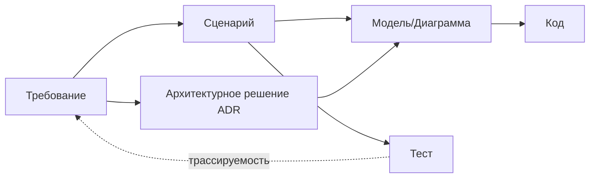
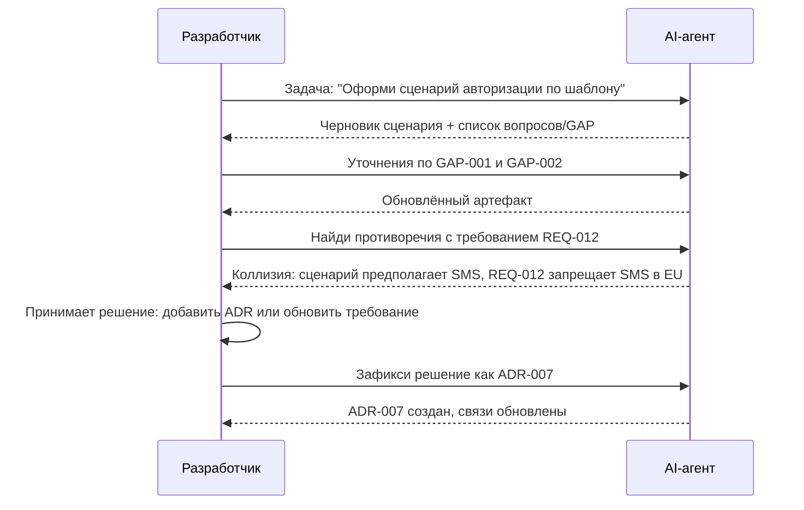
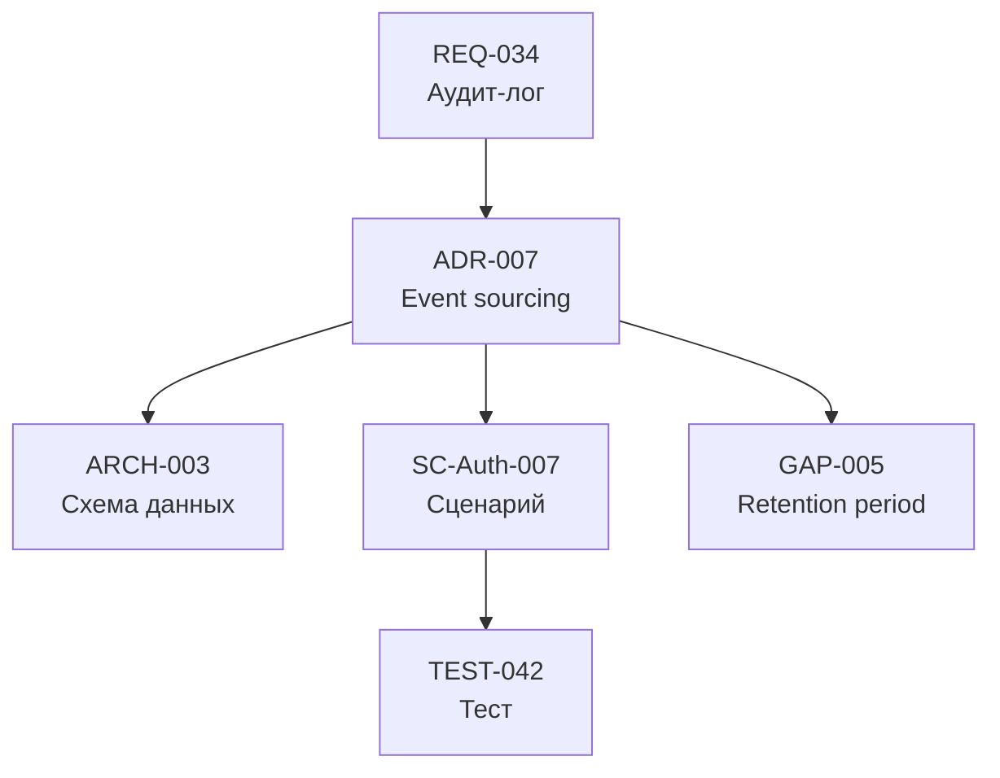

# Разработка с ИИ — Expert

## Вопросы

- [Что такое SDD как методология документирования?](#что-такое-sdd-как-методология-документирования)
- [Что такое GAP-реестр и Definition of Done в SDD?](#что-такое-gap-реестр-и-definition-of-done-в-sdd)
- [Как организовано взаимодействие с AI-агентом в рамках SDD?](#взаимодействие-с-аи-агентом-в-рамках-sdd)
- [Какую роль играют ADR в SDD и как они встраиваются в трассируемость?](#роль-adr-в-sdd-и-трассируемость)
- [Каковы ограничения и риски SDD и как их снизить?](#ограничения-и-риски-sdd)

---

## Что такое SDD как методология документирования?

**SDD (Spec-Driven Documentation)** — методический подход, который переводит документацию из набора разрозненных материалов в **управляемый связанный контур артефактов**. В отличие от docs-as-code (который отвечает на вопрос «как сопровождать документы» — версионирование, PR, CI), SDD отвечает на вопрос «что именно фиксировать и как это связано».

**Классы артефактов в SDD:**

| Слой | Что фиксируется |
|------|----------------|
| **Доменный** | Глоссарий, границы системы, ubiquitous language |
| **Требования** | Функциональные и нефункциональные требования, ограничения |
| **Сценарии** | Use cases, acceptance scenarios (Given/When/Then) |
| **Модели и диаграммы** | C4, ER, sequence diagrams — в текстовом формате |
| **Данные** | JSON Schema, OpenAPI-контракты, схемы БД |
| **Архитектура и ADR** | C4 модели, архитектурные решения и их причины |
| **Верификация** | Тест-следы, проверки, трассируемость требований → тестам |

**Трассируемость** — явные связи между артефактами, позволяющие восстанавливать причинно-следственную цепочку: `исходные данные → допущение → решение → требование → сценарий → тест`. Документация превращается в граф взаимозависимых артефактов:



Это позволяет при изменении требования автоматически выявить все затронутые сценарии, тесты и архитектурные решения.

**Связанные задачи:**
<!-- Связанных задач нет -->

**Материалы для изучения:**
- [Arc42: Architecture documentation](https://arc42.org/overview)
- [C4 Model](https://c4model.com/)

---

## Что такое GAP-реестр и Definition of Done в SDD?

**GAP-реестр** — механизм «легальной неполноты» для R&D-этапов, когда неопределённость является нормой. Вместо того чтобы «достраивать» факты или блокировать работу, пробел фиксируется явно.

Структура записи в GAP-реестре:
```markdown
## GAP-001: Стратегия шардирования данных

**Статус:** Открыт
**Влияние:** Высокое — блокирует финализацию схемы БД
**Что неизвестно:** Какой объём данных за 3 года при текущем росте?
**Варианты:**
  - A) Шардирование по tenant_id (простое, ограниченное)
  - B) Партиционирование по дате + tenant (сложнее, масштабируется)
**Кто должен подтвердить:** Архитектор + аналитик по данным
**Дедлайн:** 2025-06-01
```

Это переводит неопределённость из **неявного** состояния в **управляемое**: команда знает, что именно неизвестно, почему это важно и кто ответственен за решение.

**Definition of Done (DoD) для документации** — минимальный порог качества, при котором артефакт считается пригодным как основание для следующего шага:
- Завершённая структура по шаблону
- Ссылки на источники или явные допущения
- Критические противоречия либо устранены, либо оформлены как GAP
- Пройден ревью (человек или AI)

DoD — не бюрократия, а «точка зрелости» артефакта. Без неё AI-агент не должен использовать незрелый документ как источник истины.

**Связанные задачи:**
<!-- Связанных задач нет -->

**Материалы для изучения:**
- [ADR: Architectural Decision Records](https://adr.github.io/)

---

## Взаимодействие с AI-агентом в рамках SDD?

В SDD взаимодействие с AI-агентом — это **управляемая инженерная итерация**, а не свободный диалог. Разделение ответственности:

| Ответственность | Разработчик | AI-агент |
|----------------|-------------|---------|
| Смысловая корректность | ✅ | ❌ |
| Предметная экспертиза | ✅ | ❌ |
| Оформление по шаблонам | ❌ | ✅ |
| Поддержание согласованности | Проверяет | Поддерживает |
| Выявление GAP и коллизий | Решает | Инициирует |



**Критическое правило**: AI-агент **обязан инициировать вмешательство человека** при:
- Коллизии между артефактами
- Неоднозначности, требующей предметной экспертизы
- Архитектурно значимом выборе (trade-off)
- Обнаруженном GAP, влияющем на другие артефакты

За одну итерацию — один этап, один тип артефакта. После фиксации изменений и выявленных GAP итерация считается завершённой.

**Связанные задачи:**
<!-- Связанных задач нет -->

**Материалы для изучения:**
- [Anthropic: Claude Code — agentic patterns](https://docs.anthropic.com/en/docs/claude-code/overview)
- [LangGraph: Human-in-the-loop](https://langchain-ai.github.io/langgraphjs/how-tos/human_in_the_loop/)

---

## Роль ADR в SDD и трассируемость?

**ADR (Architectural Decision Record)** в контексте SDD — не просто логи решений, а **связующие узлы трассируемости**. Они объясняют, почему артефакты выглядят именно так.

Структура ADR в SDD-контексте:
```markdown
## ADR-007: Использование event sourcing для аудит-лога

**Контекст:** Требование REQ-034 (полный аудит-лог всех изменений данных).
Рассматривались варианты: update log table, CDC (Debezium), event sourcing.

**Решение:** Event sourcing через Kafka + EventStore.

**Причины отклонения альтернатив:**
- Update log: сложно реконструировать состояние на момент времени
- CDC: зависимость от внутренней схемы БД (нарушает изоляцию модулей)

**Последствия:**
- (+) Полная история, восстановление состояния на любой момент
- (-) Сложность eventual consistency в UI
- Влияет на: ARCH-003 (схема данных), SPEC-Auth (сценарий авторизации)

**GAP:** GAP-005 — не определён retention period для событий.
**Связанные артефакты:** REQ-034, ARCH-003, сценарий SC-Auth-007
```

Полная трассируемость через ADR:


Это ценно в R&D-режиме, когда решения принимаются при неполноте информации и затем пересматриваются: ADR сохраняет контекст выбора, что позволяет осознанно пересмотреть решение при изменении условий.

> См. также: более детальные вопросы об ADR как самостоятельной практике — [interviews/architecture/adr/](../../architecture/adr/README.md)

**Связанные задачи:**
<!-- Связанных задач нет -->

**Материалы для изучения:**
- [ADR GitHub organization](https://adr.github.io/)
- [Michael Nygard: Documenting Architecture Decisions](https://cognitect.com/blog/2011/11/15/documenting-architecture-decisions)

---

## Ограничения и риски SDD?

SDD не заменяет предметную экспертизу и архитектурное мышление — он структурирует процесс, но **не устраняет необходимость в источниках истины и ответственности за компромиссы**.

**Риски при использовании AI-агента в SDD:**

| Риск | Проявление | Снижение |
|------|-----------|---------|
| **Галлюцинации** | Правдоподобные, но неверные утверждения в артефактах | GAP-реестр, ревью человеком, ссылки на источники |
| **Дрейф терминов** | Одна сущность называется по-разному в разных документах | Единый глоссарий как первый и обязательный артефакт |
| **Формализм** | «Заполнение шаблонов для вида» без смысловой работы | DoD с критерием «артефакт используется как основание для следующего шага» |
| **Разрастание документации** | Артефакты создаются, но не используются | Принцип «создай только то, что нужно прямо сейчас» (YAGNI для документов) |
| **Ложная уверенность** | Кажется, что задокументировали = сделали | Документация — средство, а не цель |

**Оценка эффективности SDD** требует отдельной эмпирической валидации. Рекомендуемые метрики:
- Время цикла подготовки и согласования артефактов
- Число выявляемых коллизий до vs после внедрения SDD
- Трудозатраты на ревью PR с/без плана задачи
- Полнота трассируемости (% требований, покрытых тестами)

Область применимости SDD уточняется в зависимости от домена, состава команды и инструментов.

**Связанные задачи:**
<!-- Связанных задач нет -->

**Материалы для изучения:**
- [TOGAF: Architecture documentation](https://www.opengroup.org/togaf)
- [arc42: Lightweight architecture documentation](https://arc42.org/)
