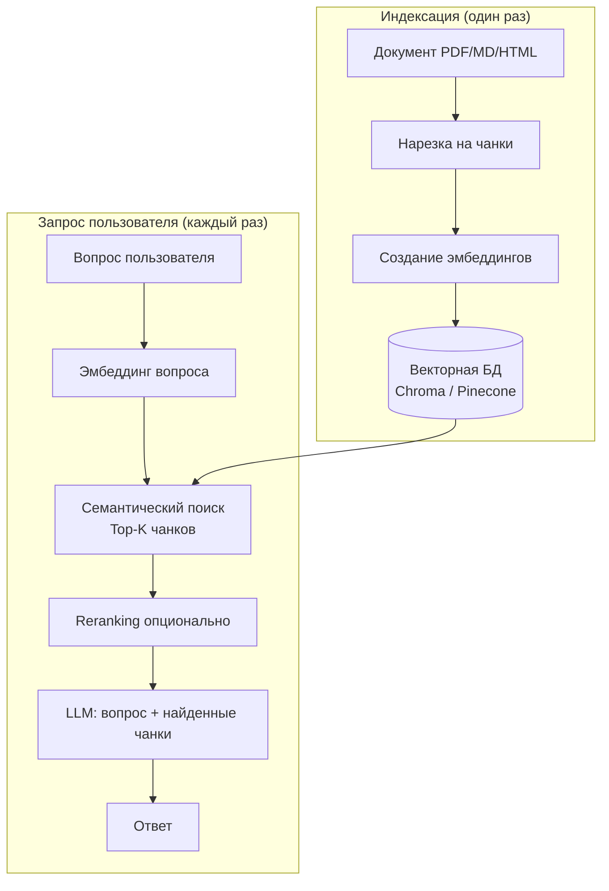
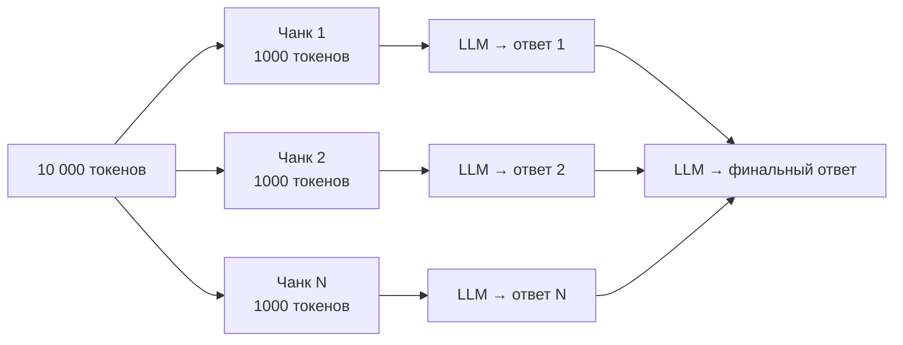

# LLM / AI — Middle

## Вопросы

- [Что такое Prompt Engineering и как писать эффективный system prompt?](#что-такое-prompt-engineering-и-как-писать-эффективный-system-prompt)
- [Что такое few-shot prompting и зачем он нужен?](#что-такое-few-shot-prompting-и-зачем-он-нужен)
- [Что такое Chain-of-Thought (CoT) и как его применять?](#что-такое-chain-of-thought-cot-и-как-его-применять)
- [Опиши полный пайплайн RAG-приложения](#опиши-полный-пайплайн-rag-приложения)
- [Что такое chunking и как выбрать размер чанка?](#что-такое-chunking-и-как-выбрать-размер-чанка)
- [Как заставить модель всегда отвечать в формате JSON?](#как-заставить-модель-всегда-отвечать-в-формате-json)
- [Как передать в модель большой документ, который не влезает в контекст?](#как-передать-в-модель-большой-документ-который-не-влезает-в-контекст)
- [Чем LangChain отличается от LlamaIndex?](#чем-langchain-отличается-от-llamaindex)
- [Как работает векторная база данных? Что такое HNSW?](#как-работает-векторная-база-данных-что-такое-hnsw)

---

## Что такое Prompt Engineering и как писать эффективный system prompt?

Prompt Engineering — практика составления текстовых инструкций (промптов) для управления поведением LLM. Качество промпта напрямую влияет на качество ответа.

Принципы эффективного system prompt:

1. **Роль** — явно задайте, кем является модель: `«Ты опытный senior frontend-разработчик»`
2. **Формат** — укажите ожидаемый формат вывода: `«Отвечай только в формате JSON»`
3. **Ограничения** — что модель НЕ должна делать: `«Не придумывай факты. Если не знаешь — скажи об этом»`
4. **Контекст** — передайте нужные данные прямо в промпт
5. **Примеры** — few-shot prompting значительно улучшает точность

```typescript
const systemPrompt = `
Ты ассистент по документации продукта ACME.

Правила:
- Отвечай только на основе предоставленного контекста
- Если ответ не найден в контексте — ответь: "Я не нашёл эту информацию в документации"
- Формат ответа: краткий абзац, затем маркированный список шагов (если применимо)
- Язык ответа: русский

Контекст:
{context}
`;
```

**Связанные задачи:**
<!-- Связанных задач нет -->

**Материалы для изучения:**
- [OpenAI: Prompt engineering guide](https://platform.openai.com/docs/guides/prompt-engineering)
- [Anthropic: Prompt engineering overview](https://docs.anthropic.com/en/docs/build-with-claude/prompt-engineering/overview)

---

## Что такое few-shot prompting и зачем он нужен?

Few-shot prompting — техника, при которой в промпт добавляются один или несколько примеров желаемого формата ввода и вывода. Модель «учится» на примерах прямо в контексте, без переобучения.

Сравнение подходов:

| Подход | Пример | Когда использовать |
|--------|--------|--------------------|
| **Zero-shot** | Просто задаёшь задачу без примеров | Простые задачи, где модель уже «понимает» задание |
| **One-shot** | 1 пример | Нестандартный формат вывода |
| **Few-shot** | 2–5 примеров | Сложный или специфический формат, классификация |

```typescript
const prompt = `
Извлеки имя и должность из текста. Отвечай в формате JSON.

Текст: "Привет, меня зовут Иван Петров, я работаю backend-разработчиком."
Ответ: {"name": "Иван Петров", "role": "backend-разработчик"}

Текст: "Это Мария Сидорова — наш product manager."
Ответ: {"name": "Мария Сидорова", "role": "product manager"}

Текст: "${userInput}"
Ответ:
`;
```

**Связанные задачи:**
<!-- Связанных задач нет -->

**Материалы для изучения:**
- [OpenAI: Few-shot prompting](https://platform.openai.com/docs/guides/prompt-engineering#tactic-use-example-exchanges-to-guide-the-model)
- [Prompt Engineering Guide: Few-Shot](https://www.promptingguide.ai/techniques/fewshot)

---

## Что такое Chain-of-Thought (CoT) и как его применять?

Chain-of-Thought (CoT) — техника, при которой модель явно инструктируется «думать вслух», разбивая задачу на промежуточные шаги перед финальным ответом. Это значительно улучшает точность на задачах с рассуждением (математика, логика, многошаговый анализ).

Два способа применения:

1. **Zero-shot CoT** — добавить фразу `«Думай шаг за шагом»` / `«Let's think step by step»`
2. **Few-shot CoT** — показать пример рассуждения в промпте

```typescript
// Zero-shot CoT
const prompt = `
У клиента есть 3 тарифных плана. Базовый — 1000₽/мес, Про — 2500₽/мес, Энтерпрайз — 8000₽/мес.
Клиент переходит с Базового на Про 15-го числа. Сколько он заплатит в этом месяце?

Думай шаг за шагом.
`;
```

CoT особенно полезен в цепочках (LangChain chains), где промежуточные рассуждения модели определяют следующее действие (например, выбор инструмента в агенте).

**Связанные задачи:**
<!-- Связанных задач нет -->

**Материалы для изучения:**
- [Prompt Engineering Guide: Chain-of-Thought](https://www.promptingguide.ai/techniques/cot)
- [Wei et al.: Chain-of-Thought Prompting (paper)](https://arxiv.org/abs/2201.11903)

---

## Опиши полный пайплайн RAG-приложения

RAG (Retrieval-Augmented Generation) — архитектурный паттерн, при котором LLM отвечает не из «памяти» (весов модели), а на основе документов, которые динамически извлекаются по запросу.



**Ключевые этапы:**
1. **Ingestion** — загрузить документы, нарезать на чанки, создать эмбеддинги, сохранить в векторную БД
2. **Retrieval** — по запросу найти top-K семантически близких чанков
3. **Generation** — передать чанки + вопрос в LLM, получить ответ

**Связанные задачи:**
<!-- Связанных задач нет -->

**Материалы для изучения:**
- [LangChain: RAG tutorial](https://python.langchain.com/docs/tutorials/rag/)
- [LlamaIndex: High-level concepts](https://docs.llamaindex.ai/en/stable/getting_started/concepts/)

---

## Что такое chunking и как выбрать размер чанка?

Chunking — разбивка документа на фрагменты (чанки) перед индексацией в векторную БД. Размер чанка напрямую влияет на качество поиска.

**Стратегии нарезки:**

| Стратегия | Когда использовать |
|-----------|-------------------|
| По фиксированному числу токенов | Быстро и просто, стартовый вариант |
| По параграфам/предложениям | Лучше сохраняет смысловые единицы |
| С перекрытием (overlap) | Контекст не теряется на границах чанков |
| Рекурсивное разбиение | LangChain `RecursiveCharacterTextSplitter` — сначала по блокам, потом по предложениям |
| По структуре документа (Markdown headers) | Для структурированных документов |

**Компромиссы:**
- **Слишком маленький чанк** (~100 токенов) → теряется контекст, ответы неполные
- **Слишком большой чанк** (~2000+ токенов) → шум, нерелевантная информация попадает в LLM, дорого

Стартовая точка: **512–1024 токена** с overlap **10–20%**.

```typescript
import { RecursiveCharacterTextSplitter } from 'langchain/text_splitter';

const splitter = new RecursiveCharacterTextSplitter({
  chunkSize: 512,
  chunkOverlap: 64,
});
const chunks = await splitter.createDocuments([documentText]);
```

**Связанные задачи:**
<!-- Связанных задач нет -->

**Материалы для изучения:**
- [LangChain: Text splitters](https://js.langchain.com/docs/concepts/text_splitters/)
- [Pinecone: Chunking strategies](https://www.pinecone.io/learn/chunking-strategies/)

---

## Как заставить модель всегда отвечать в формате JSON?

Несколько подходов в порядке надёжности:

1. **Явная инструкция в промпте** + few-shot пример (работает, но модель может нарушить)
2. **response_format: { type: "json_object" }** (OpenAI) — гарантирует валидный JSON, но не гарантирует схему
3. **Structured Outputs / JSON Schema** (OpenAI `response_format: { type: "json_schema" }`) — строгая схема, модель обязана ей следовать
4. **Валидация на стороне кода** с повтором при ошибке (Zod + retry-логика)

```typescript
import { z } from 'zod';
import { zodResponseFormat } from 'openai/helpers/zod';

const ProductSchema = z.object({
  name: z.string(),
  price: z.number(),
  inStock: z.boolean(),
});

const response = await openai.beta.chat.completions.parse({
  model: 'gpt-4o',
  messages: [{ role: 'user', content: 'Извлеки данные о товаре: iPhone 15, стоит 90000₽, есть в наличии' }],
  response_format: zodResponseFormat(ProductSchema, 'product'),
});

const product = response.choices[0].message.parsed; // типизировано как ProductSchema
```

**Связанные задачи:**
<!-- Связанных задач нет -->

**Материалы для изучения:**
- [OpenAI: Structured outputs](https://platform.openai.com/docs/guides/structured-outputs)

---

## Как передать в модель большой документ, который не влезает в контекст?

Три основных стратегии:

1. **Map-Reduce** — разбить документ на части, спросить каждую часть отдельно, затем собрать ответы вместе
2. **RAG** (лучший вариант) — индексировать документ в векторную БД, на каждый запрос доставать только релевантные чанки (обычно 3–10), передавать только их
3. **Summarization chain** — последовательно суммаризировать чанки документа, накапливая «бегущее резюме»



**Рекомендация**: для Q&A по документу — RAG. Для суммаризации всего документа — map-reduce.

**Связанные задачи:**
<!-- Связанных задач нет -->

**Материалы для изучения:**
- [LangChain: Summarization chain](https://js.langchain.com/docs/tutorials/summarization/)

---

## Чем LangChain отличается от LlamaIndex?

Оба фреймворка работают с LLM, но имеют разную специализацию:

| Критерий | LangChain | LlamaIndex |
|----------|-----------|------------|
| **Фокус** | Цепочки, агенты, оркестрация инструментов | RAG и работа с документами «из коробки» |
| **RAG** | Гибко, но нужно собирать самому | Полный пайплайн готов (загрузчики, индексы, query engine) |
| **Агенты** | Очень богатая экосистема (LangGraph) | Есть, но слабее |
| **Когда выбрать** | Сложные многошаговые агенты, интеграции | Быстро поднять RAG по своим документам |

На практике их часто комбинируют: LlamaIndex для индексации/поиска, LangChain для оркестрации агента.

**Связанные задачи:**
<!-- Связанных задач нет -->

**Материалы для изучения:**
- [LangChain JS Docs](https://js.langchain.com/docs/)
- [LlamaIndex Docs](https://docs.llamaindex.ai/)

---

## Как работает векторная база данных? Что такое HNSW?

Векторная БД хранит эмбеддинги и выполняет **approximate nearest neighbor (ANN)** поиск — находит векторы, наиболее близкие к запросу, по метрике косинусного сходства, L2 или dot product.

**HNSW (Hierarchical Navigable Small World)** — алгоритм построения графа для быстрого поиска ближайших соседей. Принцип: строится иерархия слоёв, где верхние слои — «быстрые магистрали» для грубого поиска, нижние — точный поиск в малом районе. Это даёт O(log n) вместо O(n) при поиске.

Популярные векторные БД:

| БД | Тип | Когда использовать |
|----|----|-------------------|
| **ChromaDB** | Open-source, локальная | Прототипы, маленькие проекты |
| **Pinecone** | Cloud, управляемая | Продакшен без своей инфры |
| **FAISS** | Библиотека (Meta) | Максимальная скорость, кастомная обёртка |
| **Qdrant** | Open-source + облако | Корпоративные сценарии, много данных |

```typescript
import { Chroma } from '@langchain/community/vectorstores/chroma';
import { OpenAIEmbeddings } from '@langchain/openai';

const vectorStore = await Chroma.fromDocuments(docs, new OpenAIEmbeddings(), {
  collectionName: 'my-docs',
});

// Семантический поиск
const results = await vectorStore.similaritySearch('как настроить авторизацию?', 5);
```

**Связанные задачи:**
<!-- Связанных задач нет -->

**Материалы для изучения:**
- [Pinecone: What is a vector database?](https://www.pinecone.io/learn/vector-database/)
- [ChromaDB docs](https://docs.trychroma.com/)
- [HNSW paper](https://arxiv.org/abs/1603.09320)
