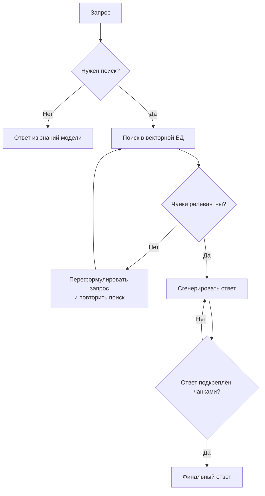
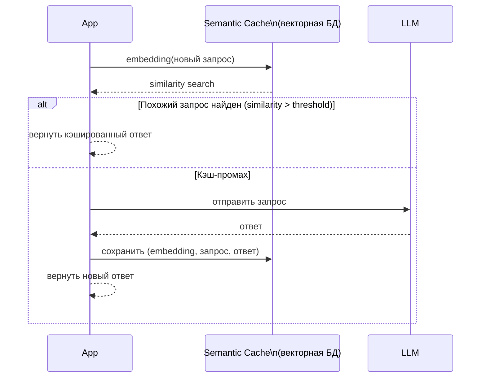
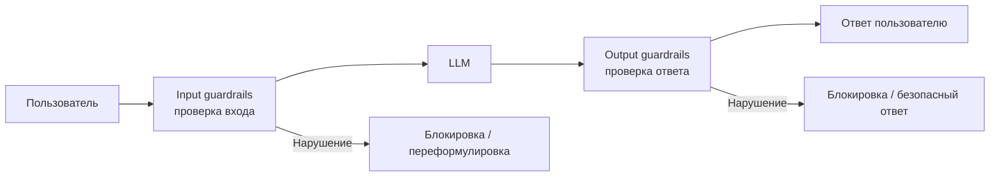

# LLM / AI — Expert

## Вопросы

- [Что такое Advanced RAG: Self-RAG и Corrective RAG?](#что-такое-advanced-rag-self-rag-и-corrective-rag)
- [Как реализовать semantic caching для снижения затрат и латентности?](#как-реализовать-semantic-caching-для-снижения-затрат-и-латентности)
- [Как работает механизм внимания (attention) в трансформере?](#как-работает-механизм-внимания-attention-в-трансформере)
- [Что такое guardrails и как их реализовать в продакшене?](#что-такое-guardrails-и-как-их-реализовать-в-продакшене)
- [Как оценить стоимость RAG-системы и оптимизировать расходы на токены?](#как-оценить-стоимость-rag-системы-и-оптимизировать-расходы-на-токены)

---

## Что такое Advanced RAG: Self-RAG и Corrective RAG?

Классический RAG имеет фундаментальный изъян: он всегда ищет документы и всегда использует найденные чанки, даже если они нерелевантны. Advanced RAG-паттерны добавляют рефлексию и самокоррекцию.

**Self-RAG (Asai et al., 2023):**
Модель сама решает — нужен ли поиск вообще (reflection token `[Retrieve]`), и оценивает качество найденных чанков (`[IsREL]`) и своего ответа (`[IsSUP]`, `[IsUSE]`). Реализуется через fine-tuned модель или через LangGraph с явными узлами проверки.



**Corrective RAG (Yan et al., 2024):**
После поиска запускается evaluator-LLM, оценивающий релевантность каждого чанка:
- **Высокая релевантность** → использовать чанк
- **Низкая релевантность** → дополнить веб-поиском (Tavily/Google)
- **Смешанная** → применить knowledge refinement (выделить только полезные предложения)

**Связанные задачи:**
<!-- Связанных задач нет -->

**Материалы для изучения:**
- [Self-RAG paper (Asai et al., 2023)](https://arxiv.org/abs/2310.11511)
- [Corrective RAG paper (Yan et al., 2024)](https://arxiv.org/abs/2401.15884)
- [LangGraph: Self-RAG tutorial](https://langchain-ai.github.io/langgraphjs/tutorials/rag/langgraph_self_rag/)

---

## Как реализовать semantic caching для снижения затрат и латентности?

**Semantic caching** — кэш, который возвращает сохранённый ответ не при точном совпадении запроса, а при семантической близости (похожий смысл → тот же ответ). В отличие от обычного key-value кэша (exact match), semantic cache работает на уровне эмбеддингов.

**Архитектура:**



**Реализация с GPTCache / LangChain:**

```typescript
import { GPTCache } from 'gptcache'; // или кастомная реализация на Qdrant

// Кастомный semantic cache
class SemanticCache {
  private threshold = 0.92; // косинусное сходство

  async get(query: string): Promise<string | null> {
    const queryEmbedding = await embedder.embedQuery(query);
    const results = await vectorDB.similaritySearchVectorWithScore(queryEmbedding, 1);

    if (results.length > 0 && results[0][1] >= this.threshold) {
      return results[0][0].metadata.cachedAnswer;
    }
    return null;
  }

  async set(query: string, answer: string): Promise<void> {
    const embedding = await embedder.embedQuery(query);
    await vectorDB.addVectors([embedding], [{
      pageContent: query,
      metadata: { cachedAnswer: answer },
    }]);
  }
}
```

**Подводные камни:**
- Порог similarity нужно тюнить: слишком низкий → неверные ответы из кэша, слишком высокий → промахи даже на похожие вопросы
- TTL (время жизни кэша) критичен для данных, которые меняются
- Кэш не подходит для персонализированных или time-sensitive запросов

**Связанные задачи:**
<!-- Связанных задач нет -->

**Материалы для изучения:**
- [GPTCache: Semantic cache for LLMs](https://github.com/zilliztech/GPTCache)
- [Redis: Semantic caching for AI](https://redis.io/blog/semantic-caching-for-ai/)

---

## Как работает механизм внимания (attention) в трансформере?

**Attention (Scaled Dot-Product Attention)** — ядро трансформера, позволяющее каждому токену «смотреть» на все остальные токены в последовательности и взвешивать их важность.

Формула:
$$\text{Attention}(Q, K, V) = \text{softmax}\!\left(\frac{QK^T}{\sqrt{d_k}}\right)V$$

- **Q (Query)** — текущий токен «задаёт вопрос»
- **K (Key)** — каждый токен «предлагает себя как ответ»
- **V (Value)** — фактическая информация, которую передаёт токен

Шаги:
1. Умножить Q на $K^T$ → матрица схожести каждого токена с каждым
2. Разделить на $\sqrt{d_k}$ → стабилизация градиентов
3. Softmax → нормализованные веса
4. Умножить на $V$ → взвешенная сумма информации

**Multi-Head Attention** — параллельный запуск нескольких attention-блоков с разными проекциями. Каждая «голова» учится обращать внимание на разные паттерны (синтаксис, семантика, кореференция).

Практическое значение для LLM-инженера:
- **KV Cache** — оптимизация инференса: Keys и Values предыдущих токенов кэшируются, не вычисляются повторно
- **Flash Attention** — оптимизированная реализация, работает с меньшим объёмом памяти
- Квадратичная сложность по длине контекста $O(n^2)$ — почему большой контекст дорог

**Связанные задачи:**
<!-- Связанных задач нет -->

**Материалы для изучения:**
- [Vaswani et al.: Attention Is All You Need (оригинальная статья)](https://arxiv.org/abs/1706.03762)
- [Andrej Karpathy: Let's build GPT (YouTube)](https://youtu.be/kCc8FmEb1nY)
- [3Blue1Brown: Attention in transformers (YouTube)](https://youtu.be/eMlx5fFNoYc)

---

## Что такое guardrails и как их реализовать в продакшене?

**Guardrails** — система проверок, ограничивающая поведение LLM: фильтрация нежелательного контента на входе и выходе, соблюдение форматов, предотвращение утечки данных.

**Уровни защиты:**



**Инструменты:**

| Инструмент | Что делает |
|-----------|-----------|
| **NeMo Guardrails** (NVIDIA) | Декларативные правила на Colang — задаёшь флоу диалога, запрещённые темы |
| **Llama Guard** (Meta) | LLM-классификатор, обученный выявлять unsafe-контент |
| **Azure Content Safety** | Managed API для модерации |
| **Кастомная цепочка** | Input → classification LLM → если unsafe → отклонить |

**Пример с NeMo Guardrails:**
```yaml
# config.yml
rails:
  input:
    flows:
      - check jailbreak
  output:
    flows:
      - check facts
      - check hallucination
```

```colang
define user ask about competitors
  "расскажи про конкурентов"
  "что лучше — вы или X?"

define flow
  user ask about competitors
  bot refuse to answer about competitors
    "Я не могу сравнивать нас с конкурентами."
```

**Связанные задачи:**
<!-- Связанных задач нет -->

**Материалы для изучения:**
- [NeMo Guardrails docs](https://docs.nvidia.com/nemo/guardrails/)
- [Meta: Llama Guard](https://ai.meta.com/research/publications/llama-guard-llm-based-input-output-safeguard-for-human-ai-conversations/)
- [OWASP LLM Top 10](https://owasp.org/www-project-top-10-for-large-language-model-applications/)

---

## Как оценить стоимость RAG-системы и оптимизировать расходы на токены?

**Расчёт стоимости (GPT-4o, май 2025):**

| Операция | Стоимость | Типичный объём |
|----------|-----------|----------------|
| Input tokens (GPT-4o) | $2.50 / 1M | вопрос + 5 чанков × 512 токенов ≈ 2 700 токенов |
| Output tokens (GPT-4o) | $10.00 / 1M | ответ ≈ 300–500 токенов |
| Embeddings (text-embedding-3-small) | $0.02 / 1M | каждый запрос ≈ 50 токенов |

**Ориентир**: 1 RAG-запрос ≈ 3 000 input + 400 output ≈ **$0.012** (~1.2 цента). 1 млн токенов ≈ $10–30.

**Стратегии оптимизации:**

1. **Semantic caching** — повторные похожие запросы не идут в LLM
2. **Меньший top-K** — 3 чанка вместо 10 → меньше input-токенов
3. **Contextual compression** — сжать чанки до релевантных предложений перед передачей в LLM
4. **Дешёвая модель для простых задач** — GPT-4o-mini (в ~16× дешевле) для классификации, маршрутизации запросов
5. **Prompt caching** (Anthropic/OpenAI) — повторяющийся system prompt кэшируется и стоит 10% обычной цены
6. **Prompt compression** — инструменты типа LLMLingua сжимают промпт с сохранением смысла

```typescript
// Prompt caching с Anthropic (повторяющиеся части помечаются cache_control)
const response = await anthropic.messages.create({
  model: 'claude-3-5-sonnet-20241022',
  messages: [{ role: 'user', content: userQuestion }],
  system: [
    {
      type: 'text',
      text: largeSystemPrompt, // 10 000 токенов кэшируется
      cache_control: { type: 'ephemeral' },
    },
  ],
});
// При повторном запросе: cached_input_tokens оплачивается по 10% от цены
```

**Связанные задачи:**
<!-- Связанных задач нет -->

**Материалы для изучения:**
- [OpenAI: Pricing](https://openai.com/api/pricing/)
- [Anthropic: Prompt caching](https://docs.anthropic.com/en/docs/build-with-claude/prompt-caching)
- [LLMLingua: Prompt compression](https://github.com/microsoft/LLMLingua)
